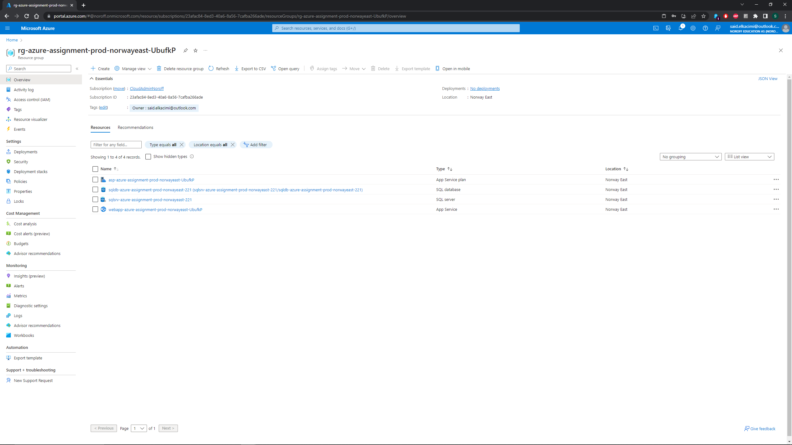
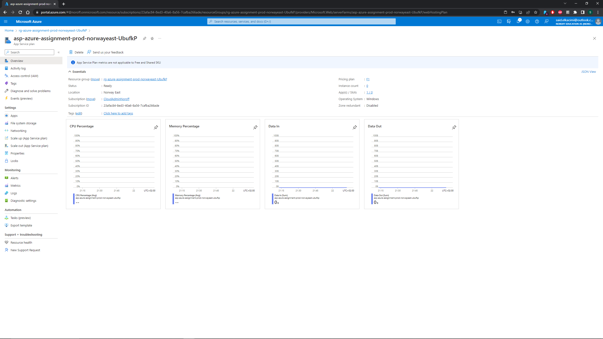
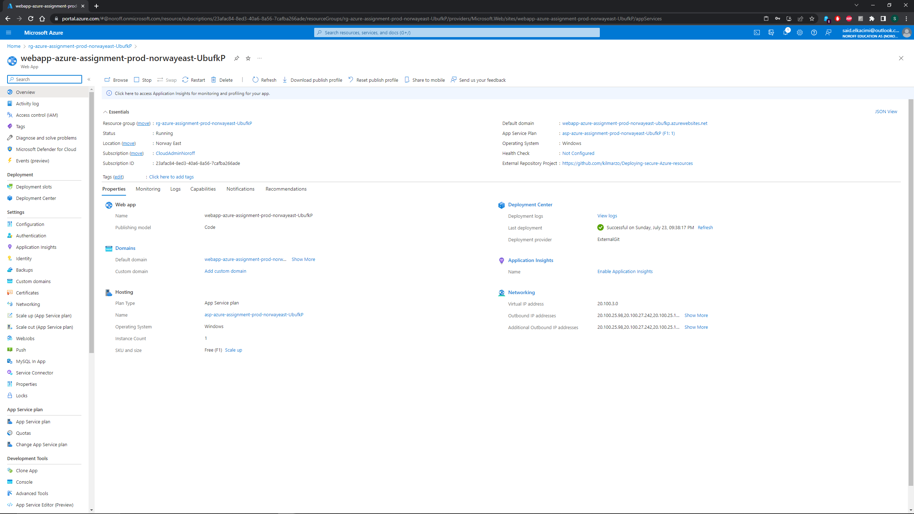
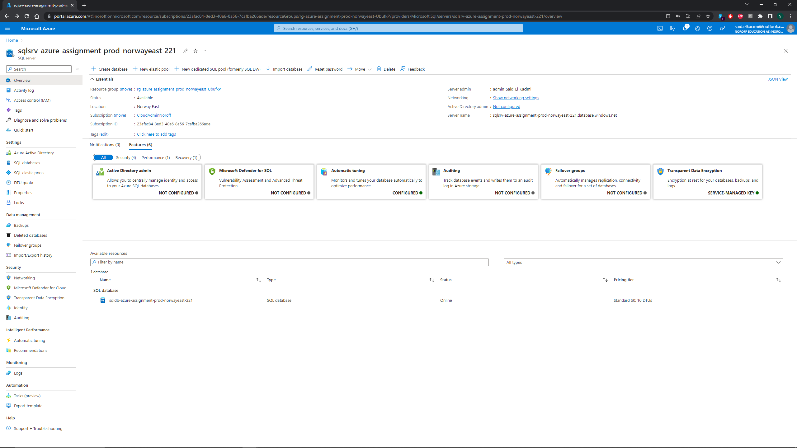
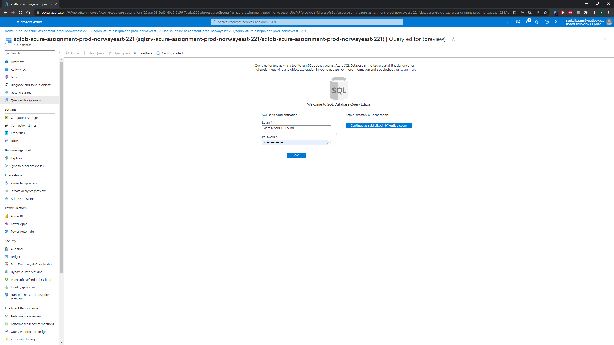
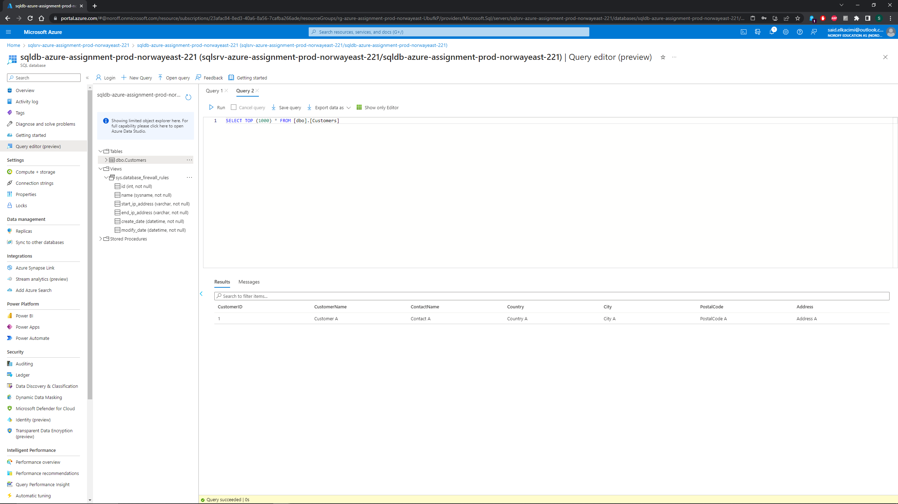

# Azure Resources Deployment Assignment

The purpose of this assignment is to gain hands-on experience in creating Azure resources using shell-based tools and to secure the created resources through Azure Active Directory.

## Pre-requisites

1. Azure Portal with an active subscription
2. Proficiency in working with Azure CLI, PowerShell & Active Directory
3. Git repository: https://github.com/kilmarzo/Deploying-secure-Azure-resources

## Section 1: Create a Web Application using Azure CLI

Developed a .NET web API application and published its code into a Git repository. Created a Resource Group with a randomly assigned unique name, serving as the central container for all subsequent resources, services, and components.

Created and configured a Web Server (App Service Plan) in a free tier, and a Web App hosted within the App Service Plan. Deployed the .NET web API to the Web App. 

The commands for this section are as follows (using PowerShell):

```bash
# Define your variables
$workload = "azure-assignment"
$environment = "prod"
$region = "norwayeast"

# Generate a unique string
$unique_string = -join ((65..90) + (97..122) | Get-Random -Count 6 | % {[char]$_})

# Construct your resource group name
$rg_name="rg-${workload}-${environment}-${region}-${unique_string}"

# Create the resource group
az group create --name $rg_name --location $region
```

Refer to azure_cli_commands.txt for the complete list of commands used.

## Section 2: Create an Azure SQL Database & Secure it with a Firewall using Azure PowerShell

Used the previously created Resource Group and arranged all the resources into it. Created a Sql Database Server with necessary configurations and protected it with an admin username/password. Set up the firewall rule to connect and access the Azure SQL database from any source. Created a Database within SQL Database Server.

The commands for this section are as follows (using PowerShell):

```bash
$serverName = "<server-name>" # The globally unique name for your SQL Server instance
$location = "norwayeast" # The location/region where the SQL Server will be created
$adminSqlLogin = "<admin-username>" # The admin username for the SQL Server
$password = "<admin-password>" # The admin password for the SQL Server
$databaseName = "<database-name>" # The name of the database that you will create on the server

# Firewall rule to allow all incoming connections
az sql server firewall-rule create --resource-group $rg_name --server $serverName -n AllowAll --start-ip-address 0.0.0.0 --end-ip-address 255.255.255.255
```

Refer to azure_powershell_scripts.txt for the complete list of commands used.

## Submission

This repository contains:

1. This README, a written description of the deployment process.
2. Azure CLI commands saved in azure_cli_commands.txt.
3. Azure PowerShell scripts saved in azure_powershell_scripts.txt.
4. Screenshots of deployed services in the images/ directory.

## Screenshots

# Azure Resource Deployment

This project involves the creation and management of Azure resources, including a Web Application and a SQL Database. The resources are created and configured using the Azure CLI and PowerShell.

## Section 1: Create a Web Application using Azure CLI

The first part of the assignment was to develop a .NET web API application and publish its code into a Git repository. The web application was then deployed on Azure.

### Resource Group

A resource group was created to serve as the central container for all the resources, services, and components involved in the project.



### App Service Plan

An App Service Plan was created and configured to support web hosting.



### Web App

A Web App was created within the previously configured Web Server and the .NET web API was deployed to this Web App.



## Section 2: Create an Azure SQL Database & Secure it with a Firewall using Azure PowerShell

A SQL Database Server was created and protected with an admin username/password. The server was then secured with a firewall rule to allow access from any source. A database was created within the SQL Database Server to maintain tables and organize data.

### SQL Server

The SQL Server was created with necessary configurations.



### SQL Database Login

Access to the database was secured with an admin login.



### SQL Database Firewall

A firewall rule was set up to connect and access the Azure SQL database from any source.




---

Author: Said el Kacimi
Special thanks to Mr. Mirzaei and Mr. Mohanand for their help in my assignment.
